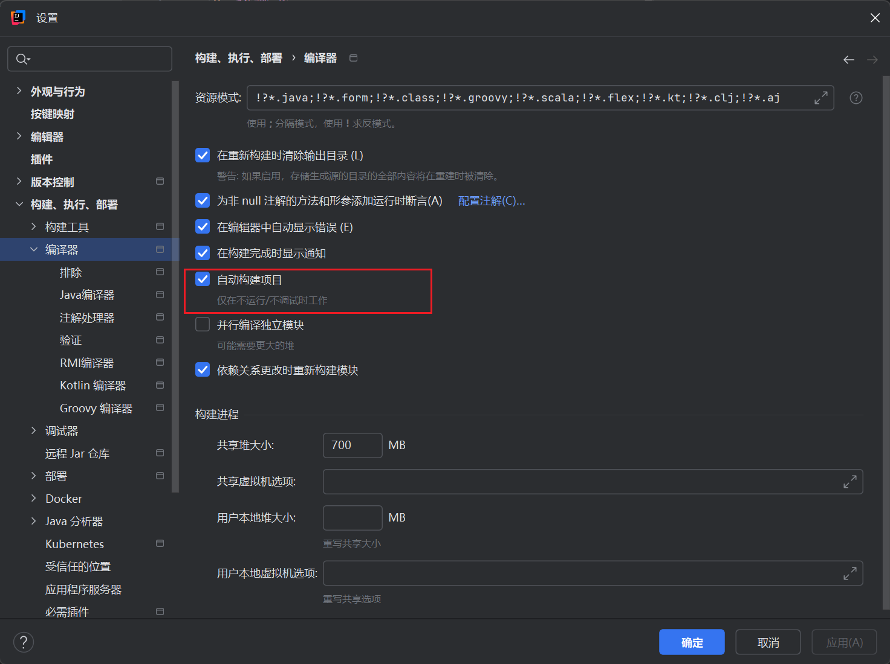
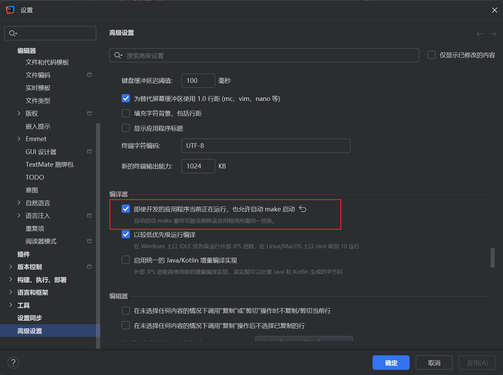

# 参考文章

[SpringBoot之如何实现热部署？超级详细，建议收藏](https://blog.csdn.net/ww2651071028/article/details/129435448)

[SpringBoot篇（热部署）](https://blog.csdn.net/qq_51226710/article/details/143368588)

[Spring Boot 热部署](https://blog.csdn.net/m0_62617719/article/details/130824260)

[springboot3整合swagger](https://blog.csdn.net/zhengyibeici/article/details/134867788)

[【SpringBoot整合系列】SpringBoot3.x整合Swagger](https://blog.csdn.net/weixin_37833693/article/details/137050893)


# 热部署

## maven配置

```xml
        <dependency>
            <groupId>org.springframework.boot</groupId>
            <artifactId>spring-boot-devtools</artifactId>
            <optional>true</optional>
        </dependency>
```

## 手动启动热部署

`Ctrl + F9`

## 自动启动热部署

设置-> 构建、执行、部署-> 编译器




设置-> 高级设置-> 编译器




# 拦截器

## 配置类

```java
package com.fire.myquickspringboot.config;

import com.fire.myquickspringboot.interceptor.LoginInterceptor;
import org.springframework.context.annotation.Configuration;
import org.springframework.web.servlet.config.annotation.InterceptorRegistry;
import org.springframework.web.servlet.config.annotation.WebMvcConfigurer;

@Configuration
public class WebConfig implements WebMvcConfigurer {
    @Override
    public void addInterceptors(InterceptorRegistry registry) {
        registry.addInterceptor(new LoginInterceptor()).addPathPatterns("/user/**");
    }
}


```

## 示例

```java
package com.fire.myquickspringboot.interceptor;

import jakarta.servlet.http.HttpServletRequest;
import jakarta.servlet.http.HttpServletResponse;
import org.springframework.web.servlet.HandlerInterceptor;

public class LoginInterceptor implements HandlerInterceptor {
    @Override
    public boolean preHandle(HttpServletRequest request, HttpServletResponse response, Object handler) throws Exception {
        System.out.println("LoginInterceptor preHandle");
        return true;
    }
}


```

# swagger

参考文章: [Java21 + SpringBoot3整合springdoc-openapi，自动生成在线接口文档，支持SpringSecurity和JWT认证方式](https://blog.csdn.net/kingslave1/article/details/135947881)

## maven配置

```xml
<!-- openAPI包，替换 Swagger 的 SpringFox -->
        <dependency>
            <groupId>org.springdoc</groupId>
            <artifactId>springdoc-openapi-starter-webmvc-ui</artifactId>
            <version>2.5.0</version>
        </dependency>

        <dependency>
            <groupId>org.projectlombok</groupId>
            <artifactId>lombok</artifactId>
            <optional>true</optional>
        </dependency>
```

## 配置类

```java
package com.fire.myquickspringboot.config;

import org.springframework.context.annotation.Bean;
import org.springframework.context.annotation.Configuration;
import io.swagger.v3.oas.models.ExternalDocumentation;
import io.swagger.v3.oas.models.OpenAPI;
import io.swagger.v3.oas.models.info.Info;
import io.swagger.v3.oas.models.info.License;

/**
 * 访问:http://localhost:8080/swagger-ui/index.html
 */
@Configuration
public class SwaggerConfig {
 
    @Bean
    public OpenAPI springShopOpenAPI() {
        return new OpenAPI()
                .info(new Info().title("标题")
                        .description("我的API文档")
                        .version("v1")
                        .license(new License().name("Apache 2.0").url("http://springdoc.org")))
                .externalDocs(new ExternalDocumentation()
                        .description("外部文档")
                        .url("https://springshop.wiki.github.org/docs"));
    }
 
}
```

## swagger2与swagger3常用注解对比

|swagger2   |swagger3   | 注解位置                         |
|---|---|------------------------------|
| @Api  | @Tag(name = “接口类描述”)  | Controller 类                 |
| @ApiOperation  | @Operation(summary =“接口方法描述”)  | Controller 方法                |
| @ApiImplicitParams	  | @Parameters  | Controller 方法                |
|  @ApiImplicitParam | @Parameter(description=“参数描述”)  | Controller 方法的 @Parameters 里 |
| @ApiParam  | @Parameter(description=“参数描述”)  | Controller 方法的参数上            |
| @ApiIgnore  | @Parameter(hidden = true) 或 @Operation(hidden = true) 或 @Hidden  | -                            |
|  @ApiModel | @Schema  |  DTO类上                            |
| @ApiModelProperty  | @Schema  |   DTO属性上                           |


## 示例

```java
package com.fire.myquickspringboot.entity;

import io.swagger.v3.oas.annotations.media.Schema;
import lombok.Data;

import java.io.Serializable;

/**
 * @author: zjl
 * @datetime: 2024/3/26
 * @desc:
 */
@Data
@Schema(description= "学生信息")
public class SwaggerApiModel implements Serializable {

    @Schema(description = "主键ID", required = true, example = "1")
    private Long id;

    @Schema(description = "手机号", required = true)
    private String phonenum;

    @Schema(description = "密码", required = true)
    private String password;

    @Schema(description = "年龄", required = true)
    private Integer age;

}


```

```java
package com.fire.myquickspringboot.controller;


import com.fire.myquickspringboot.entity.SwaggerApiModel;
import io.swagger.v3.oas.annotations.Hidden;
import io.swagger.v3.oas.annotations.Operation;
import io.swagger.v3.oas.annotations.Parameter;
import io.swagger.v3.oas.annotations.Parameters;
import io.swagger.v3.oas.annotations.responses.ApiResponse;
import io.swagger.v3.oas.annotations.responses.ApiResponses;
import io.swagger.v3.oas.annotations.tags.Tag;
import org.springframework.web.bind.annotation.*;
/**
 * @author: zjl
 * @datetime: 2024/3/26
 * @desc:
 */
@Tag(name = "控制器：测试Swagger3", description = "描述：测试Swagger3")
@RestController
public class SwaggerController {

    @Operation(summary = "测试Swagger3注解方法Get")
    @Parameters({@Parameter(name = "id",description = "编码"),
            @Parameter(name = "headerValue",description = "header传送内容")})
    @ApiResponses({
            @ApiResponse(responseCode = "200", description = "请求成功"),
            @ApiResponse(responseCode = "400", description = "请求参数没填好"),
            @ApiResponse(responseCode = "401", description = "没有权限"),
            @ApiResponse(responseCode = "403", description = "禁止访问"),
            @ApiResponse(responseCode = "404", description = "请求路径没有或页面跳转路径不对")
    })
    @GetMapping(value = "/swagger/student")
    public Object getStudent(@RequestParam @Parameter(example = "2")  String id,
                             @RequestHeader @Parameter(example = "2") String headerValue){
        return id;
    }

    @Operation(summary = "测试Swagger3注解方法Post")
    @ApiResponses({
            @ApiResponse(responseCode = "200", description = "请求成功"),
            @ApiResponse(responseCode = "400", description = "请求参数没填好"),
            @ApiResponse(responseCode = "401", description = "没有权限"),
            @ApiResponse(responseCode = "403", description = "禁止访问"),
            @ApiResponse(responseCode = "404", description = "请求路径没有或页面跳转路径不对")
    })
    @PostMapping(value = "/swagger/student", produces = "application/json")
    public SwaggerApiModel updateStudent(@RequestBody SwaggerApiModel model){
        return model;
    }


    /**
     * swagger 不暴漏该 api，通过@Hidden隐藏
     * 但是仍然可以访问
     * @return
     */
    @Hidden
    @GetMapping(value = "/swagger/hiddenApi")
    public String hiddenApi(){
        return "hiddenApi";
    }

    /**
     * swagger 暴漏该 api，没有配置@Hidden会展示
     * @return
     */
    @GetMapping(value = "/swagger/noHiddenApi")
    public String noHiddenApi(){
        return "noHiddenApi";
    }
}


```

访问:

http://localhost:8080/swagger-ui/index.html
